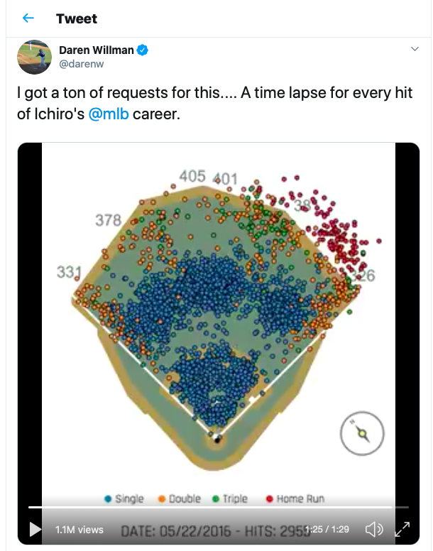
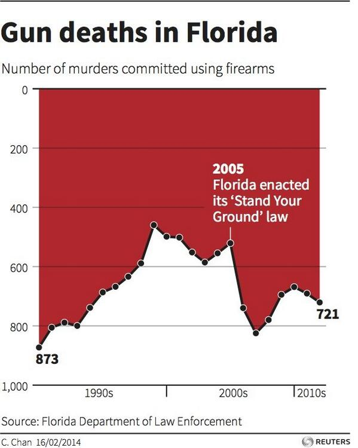

```{r, include=FALSE}
library(devtools)
library(tweetrmd)
library(webshot)
library(webshot2)
```

## Good Visual


[Tweet](https://twitter.com/darenw/status/993156750344904704?s=20)


This visual was created by the Director of Research for the MLB. He does a lot of cool visuals when milestones happen in the MLB. This particular visual was created after Ichiro Suzuki retired. He ended his career 23rd all-time in career hits. Daren plotted all 3,089 of Ichiro's hits. 

I think this visual works a many levels. I think the animation of the hits shows the progression of Ichiro's career. He started his career hitting some homeruns and as his career progressed, it shows he became a contact hitter, looking to get on base with singles. This visual also gives some insight into the power of data in baseball. Having the hits of a player shows an opposing team tendicies of the hitter and the hot spots the hitter likes to hit the ball too. This coud be used by the defense to place defender where the probability is higher that the hitter will hit the ball too. I also think the different coloring works for this visualization, it shows when a double turns into a triple, meaning the hitter legged out a hit or something funky happened with the defenders. 


## Bad Visual



This visual is historically bad. This was used by the Florida Law Enforcement. They were trying to prove that the number of murders committed by firearms had increased since the 1990's. This graph was indeed published by Reuters, and the author said she was trying out a method of visualization she saw of deaths in Iraq, symbolizing dripping blood.

I don't think this visual does the job to properly represent gun deaths in Florida. The y-axis is reversed, causing the reader to quickly misinterpret the data. At a glance it appears the deaths by firearms went up since 1990, when you look closer the deaths actually decreased in that timeframe. I think the coloring is also a mistake, if the point was really to show the decrease in firearm deaths, red might have been the wrong color. Red depicts negative and foreboding, so at a glance the color would go with the intial reading that deaths increased. Overall, there is alot of mistakes made in making this graph.

