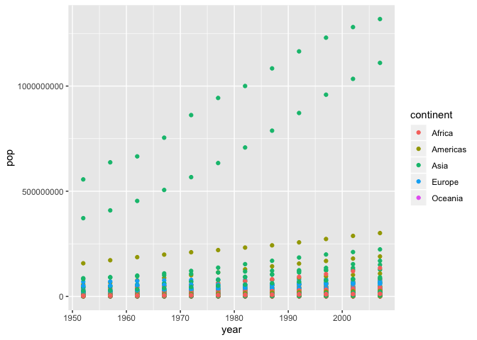
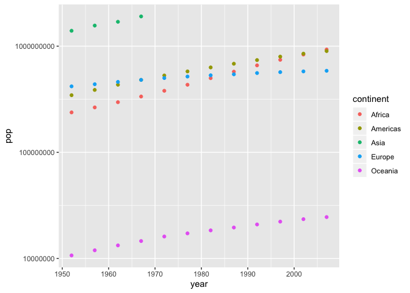
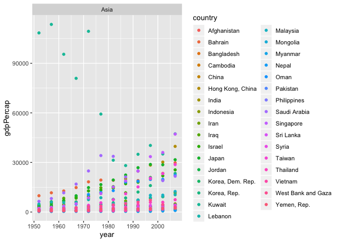
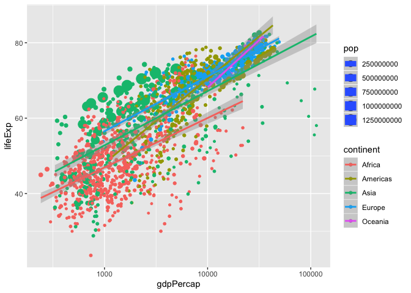
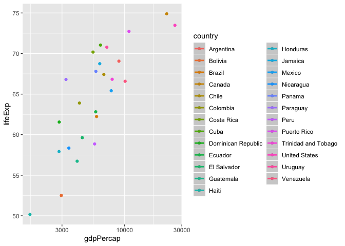
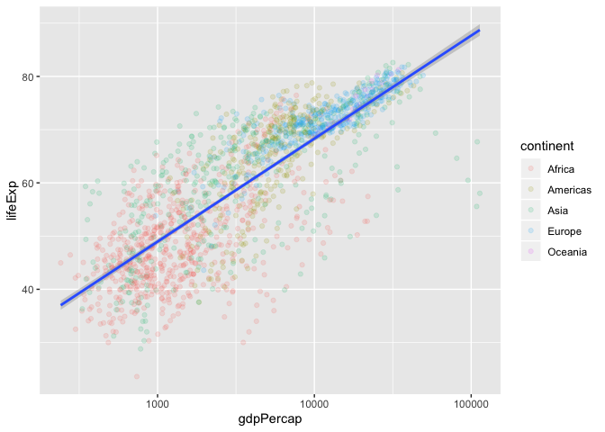
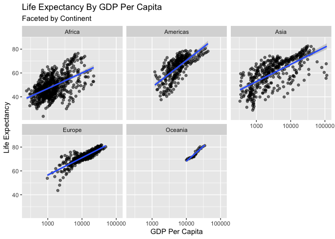
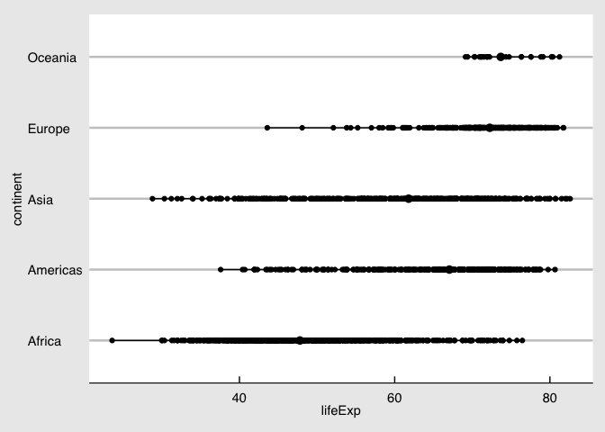

``` r
data("gapminder")

str(gapminder)
```

    ## Classes 'tbl_df', 'tbl' and 'data.frame':    1704 obs. of  6 variables:
    ##  $ country  : Factor w/ 142 levels "Afghanistan",..: 1 1 1 1 1 1 1 1 1 1 ...
    ##  $ continent: Factor w/ 5 levels "Africa","Americas",..: 3 3 3 3 3 3 3 3 3 3 ...
    ##  $ year     : int  1952 1957 1962 1967 1972 1977 1982 1987 1992 1997 ...
    ##  $ lifeExp  : num  28.8 30.3 32 34 36.1 ...
    ##  $ pop      : int  8425333 9240934 10267083 11537966 13079460 14880372 12881816 13867957 16317921 22227415 ...
    ##  $ gdpPercap: num  779 821 853 836 740 ...

``` r
ggplot(data = gapminder, mapping = aes(x = year, y = pop, color = continent)) +
  geom_point()
```

<!-- -->

``` r
gapminder %>% 
  group_by(year, continent) %>%
  summarise(pop = sum(pop)) %>%
ggplot(data = ., mapping = aes(x = year, y = pop, color = continent)) +
  geom_point() +
  scale_y_log10()
```

    ## Warning in summarise_impl(.data, dots, environment(), caller_env()):
    ## integer overflow - use sum(as.numeric(.))
    
    ## Warning in summarise_impl(.data, dots, environment(), caller_env()):
    ## integer overflow - use sum(as.numeric(.))
    
    ## Warning in summarise_impl(.data, dots, environment(), caller_env()):
    ## integer overflow - use sum(as.numeric(.))
    
    ## Warning in summarise_impl(.data, dots, environment(), caller_env()):
    ## integer overflow - use sum(as.numeric(.))
    
    ## Warning in summarise_impl(.data, dots, environment(), caller_env()):
    ## integer overflow - use sum(as.numeric(.))
    
    ## Warning in summarise_impl(.data, dots, environment(), caller_env()):
    ## integer overflow - use sum(as.numeric(.))
    
    ## Warning in summarise_impl(.data, dots, environment(), caller_env()):
    ## integer overflow - use sum(as.numeric(.))
    
    ## Warning in summarise_impl(.data, dots, environment(), caller_env()):
    ## integer overflow - use sum(as.numeric(.))

    ## Warning: Removed 8 rows containing missing values (geom_point).

<!-- -->

``` r
gapminder %>%
  filter(continent == "Asia") %>%
ggplot(data = ., aes(x = year, y = gdpPercap, color = country)) +
  geom_point() +
  facet_wrap(~continent)
```

<!-- -->

try tow numeric
values

``` r
ggplot(gapminder, aes(gdpPercap, lifeExp, color = continent, size = pop)) +
  geom_point() +
  scale_x_log10() +
  stat_smooth(method = "lm")
```

<!-- -->

Changing mapping fo population

``` r
gapminder %>%
  filter(continent == "Americas") %>%
  group_by(country) %>%
  summarise(gdpPercap = mean(gdpPercap),
            lifeExp = mean(lifeExp)) %>%
ggplot(., aes(gdpPercap, lifeExp, color = country)) +
  geom_point() +
  scale_x_log10() +
  stat_smooth(method = "lm")
```

<!-- -->

``` r
ggplot(gapminder,aes(gdpPercap,lifeExp)) +
  geom_point(aes(color = continent), alpha = .15) + 
  scale_x_log10() +
  stat_smooth(method = "lm")
```

<!-- -->

``` r
ggplot(gapminder,aes(gdpPercap,lifeExp)) +
  geom_point(alpha = .55) + 
  scale_x_log10() +
  stat_smooth(method = "lm") +
  facet_wrap(~continent) +
  ggtitle("Life Expectancy By GDP Per Capita", subtitle = "Faceted by Continent") +
  xlab("GDP Per Capita") +
  ylab("Life Expectancy") 
```

<!-- -->

``` r
ggplot(gapminder,aes(continent,lifeExp)) +
  stat_summary(fun.ymin =  min,
               fun.ymax =  max,
               fun.y = median) +
  geom_point() +
  coord_flip() +
  theme_economist_white() 
```

<!-- -->
